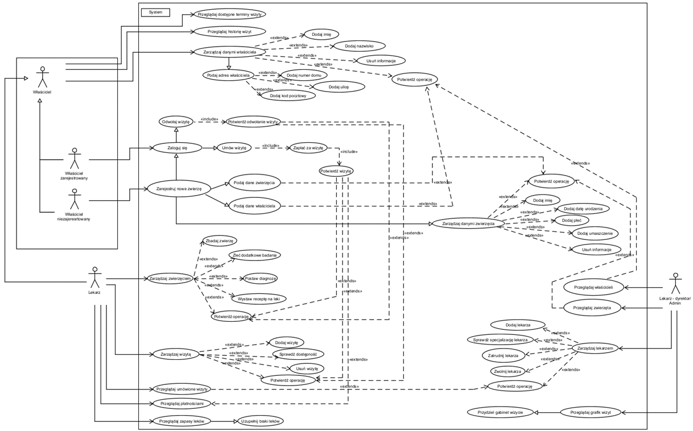
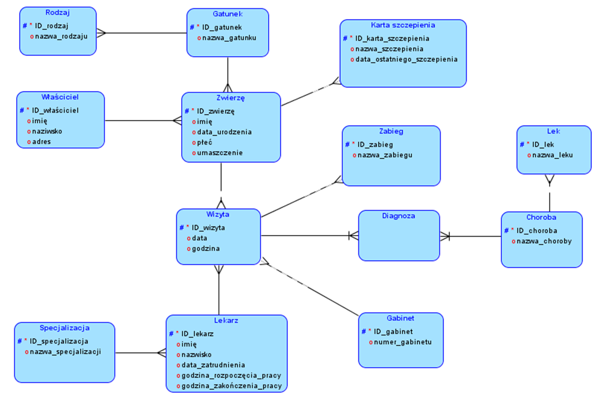
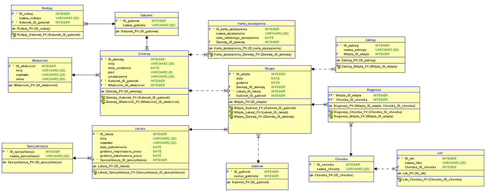

# About project
The project involves creating a comprehensive database for a veterinary clinic, enabling management of patient information, appointments, doctors, medications, vaccinations, animal owners, and many other relevant data.
The project also includes adding sample data to individual tables using INSERT clause to enhance understanding of database functionality. Sample SQL queries have been created to demonstrate data analysis capabilities, such as displaying animal information, selecting animals based on age criteria, count of animals by species, and medical visit statistics.

## Diagrams
### Diagram UML

### ERD

### Class diagram

